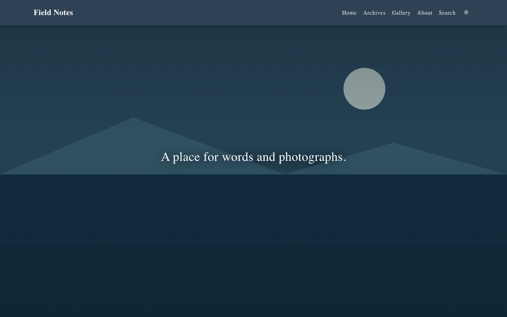
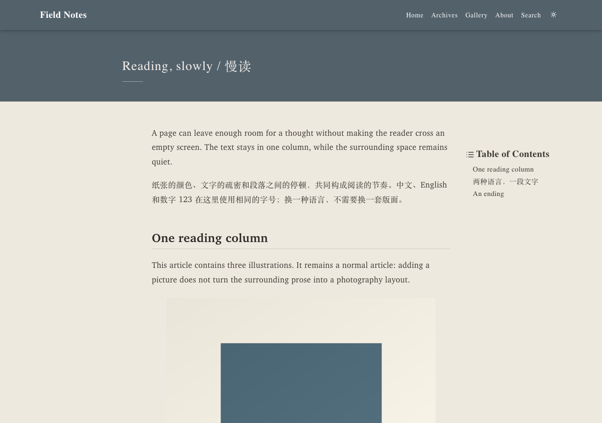
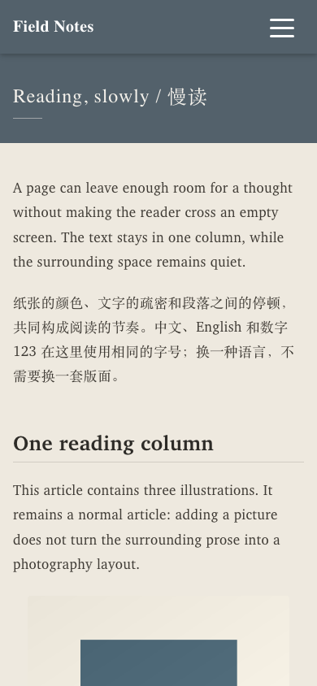

# bluenote

A quiet editorial theme for [Hexo](https://hexo.io/): paper tones, serif Latin and CJK typography, an image-led home page, and light and dark schemes. Plain CSS, JavaScript and EJS; no frontend framework, icon font or third-party requests.

Built for [Blue Note](https://cheology.github.io/bluenote/). The theme is independent of that site's articles, photographs and private archive.



| Reading on desktop | Reading on a phone |
| --- | --- |
|  |  |

[Dark reading](docs/screenshots/article-dark.png) · [Gallery on desktop](docs/screenshots/gallery-desktop.png) · [Gallery on a phone](docs/screenshots/gallery-mobile.png)

## Related text at the end of an article

An optional related-text link can be placed at the end of an article with Front Matter:

```yaml
companion:
  url: https://example.com/response/
  label: Related reading
  aria_label: Read the response to this article
```

The link appears once, outside the authored body and before previous/next navigation, as a slim reading-width strip. It shares the navigation type size and the theme’s quiet panel colours, with a trailing up-right arrow. The entire strip is a native link with a minimum 56px height. Labels are escaped, URLs must use HTTPS without credentials, and private or unconfigured posts have no link. The reading strip requires 1.2.2 or newer.

## Install in an existing Hexo site

Requirements: Node 20.19+, Hexo 7+, an EJS renderer and a Markdown renderer. The example has been built with Hexo 7.3 and 8.1.

```bash
npm install git+https://github.com/CHEology/hexo-theme-bluenote.git#v1.1.0
npm install hexo-renderer-ejs hexo-renderer-marked hexo-generator-index hexo-generator-archive hexo-generator-tag hexo-generator-search
```

Set the site configuration:

```yaml
# _config.yml
theme: bluenote
search:
  path: search.xml
  field: post
  content: true
```

Create `_config.bluenote.yml` to override the theme defaults. For example:

```yaml
home:
  cover: /images/cover.jpg
  slogan: A place for words and photographs.
  typing:
    enable: true
    mobile: false
search:
  enable: true
```

Use your own image in `source/images/cover.jpg`. Leaving the cover empty gives a solid blue background. Search follows the site's `search.path`; disabling it removes the menu entry and the browser module.

A checkout in `themes/bluenote` takes precedence over the npm dependency. Remove it after development so your local preview and deployed dependency agree.

## Try the complete example

The [example](example/) contains a small bilingual journal, an About page and an optional Gallery. Its text and geometric images are original demonstration content; none of the author's blog content is included.

```bash
git clone https://github.com/CHEology/hexo-theme-bluenote.git
cd hexo-theme-bluenote/example
npm install
npm run server
```

Open http://localhost:4000/. To publish your own site, set `url` and `root` in `example/_config.yml`, replace the demonstration content, and install the versioned theme dependency instead of `file:..`.

The example's `.npmrc` installs a packed copy of the parent theme instead of a recursive directory link. To refresh local theme edits, remove `example/node_modules/hexo-theme-bluenote` and run `npm install` from `example` again.

## Optional Gallery

Gallery is disabled by default. It adds no generated pages or assets while disabled.

```yaml
# _config.bluenote.yml
gallery:
  enable: true
  path: gallery
  data: gallery
  title: Gallery
  language: en
```

Add `source/_data/gallery.json` containing `{"version":1,"photos":[]}`, then supply your own image entries. The empty collection is valid. The two generated views are `/gallery/` (a random selection of 3–5 images) and `/gallery/all/` (the complete authored order). Smaller collections show what is available.

[Gallery setup and manifest reference](modules/gallery/README.md) explains previews, paired images, sequences, custom paths, translation and accessibility. CSS and JavaScript load only on the Gallery pages.

## Article layout

Normal articles retain their reading column, headings and captions regardless of how many images they contain. Select a wide photography layout explicitly:

```yaml
---
title: A visual sequence
date: 2026-01-01
photo_layout: true
---
```

The title, date and prose stay under the author's control. A theme never needs to invent headings or rewrite an article to create a layout.

Other front matter: `description` for cards and metadata; `toc: false`; `lightbox: false`; `content_language: zh-CN`; `cover` or `og_img` for social previews. `layout: about` selects the About header. Ordinary pages use `layout: page`.

## Configuration reference

The commented [_config.yml](_config.yml) is the full reference. Site overrides merge into it; arrays such as `nav.menu` merge by index, so the default menu is intentionally empty and the template provides fallback entries.

| Key | Default | Meaning |
| --- | --- | --- |
| `brand` | site title | Navigation title |
| `favicon`, `apple_touch_icon` | empty | Local icon paths; use a small favicon and a 180×180 touch icon |
| `force_https` | true | Emit the HTTPS resource-upgrade policy |
| `fonts.*`, `colors.light.*`, `colors.dark.*`, `colors.home.*` | paper/serif palette | CSS tokens |
| `nav.menu` | Home, Archives, About, Search | Entries: `{ name, link, icon, target }` |
| `nav.scheme_toggle`, `nav.solid_after` | true, 50 | Colour toggle and scroll threshold |
| `home.cover`, `home.slogan` | empty, site subtitle | Cover and slogan |
| `home.typing.enable/mobile/speed/cursor` | true / false / 70 / _ | Desktop typing; complete text immediately on phones by default |
| `home.cards/excerpt/date/pagination` | 12 / true / true / false | Home cards; match the site's `index_generator.per_page` to the desired card count |
| `post.language` | empty | Default article language, independent of interface language |
| `post.toc` | enabled, depths 1–6 | Desktop table of contents |
| `post.prev_next/show_tags/heading_anchors` | true / false / true | Article navigation and anchors |
| `post.figure_captions.enable/skip_filename_alt` | true / true | Use author-supplied image alt/title as captions; skip filenames |
| `post.lightbox` | true | Keyboard-accessible image dialog |
| `post.photo_layout.enable` | true | Allow explicit `photo_layout: true` posts |
| `archive.show_total/extra_entries` | false / [] | Counts and additional rows |
| `about.avatar/name/intro/links` | empty | About header |
| `tags.enable/categories.enable` | true / false | Tag/category index pages |
| `page404.enable/cover` | true / empty | 404 page |
| `dark_mode.enable/default/storage_key` | true / auto / bluenote.color-scheme | Colour preference |
| `search.enable/path` | true / site search.path | Local XML search with loading, empty and retry states |
| `search.private_manifest` | empty | Optional private archive integration; no request when empty |
| `gallery.*` | disabled | Optional photo collection |
| `open_graph.enable/twitter_card` | true / summary_large_image | Social metadata |
| `asset_version` | true | Content hashes for local CSS/JS |
| `footer.content`, `custom_css`, `custom_js` | empty | Site extensions |

## Local verification and maintenance

No CI workflow is included. Run the checks locally:

```bash
# From the theme repository root
npm ci
npm test
npx playwright install chromium webkit
npm run test:browser
npm run screenshots
```

The tests build independent sites at a domain root and a subdirectory, check disabled features and Gallery paths, then exercise search, keyboard focus, captions, image dialogs and responsive widths in Chromium and WebKit. Test HTTP servers omit the production HTTPS-upgrade meta tag so WebKit can load loopback HTTP assets; generated production HTML retains it.

Screenshots come from the example, not the personal blog. Runtime assets live in `assets/`; the optional Gallery lives in `modules/gallery/`. Both ship as plain source. Keep the palette configurable and preserve article wording.

Stable extension hooks include `html[data-root]`, `html[data-scheme]`, `.markdown-body`, `.literary-panel`, `.index-card`, `.listing__item`, and `window.BlueNote.nav.close()`. Generated pages may supply `body_class`. Optional private search listens for `bluenote:private-unlocked`; encryption and authentication are not supplied by the theme.

## Upgrade from 1.0

- Add `photo_layout: true` to actual photography posts; image count no longer selects the layout.
- Sites using the Blue Note private archive must explicitly set `search.private_manifest: /private/posts.public.json`.
- Gallery is opt-in and requires the site's own manifest.
- Mobile slogans now appear immediately; set `home.typing.mobile: true` to retain mobile typing.

## License

MIT. Bundled components retain their own licenses; see [THIRD-PARTY-LICENSES.md](THIRD-PARTY-LICENSES.md).
